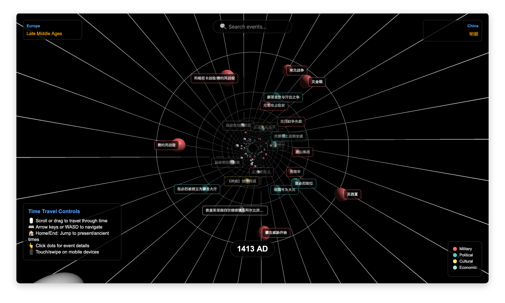

# 欧洲大事年表项目

## 需求描述
1. 我希望用一个实际的大模型项目，来让我熟悉LangChain的使用，因此我选定了一个项目方向，希望生成一个Jypyter Notebook，在里面用文档写明项目实现的步骤，比如安装依赖，抓取数据，保存数据库等，分别写在不同的cell里，可以反复被执行，Notebook的最终输出是一个数据库，后续将脱离Notebook，使用这些数据创建应用
2. 我的项目方向是做一个生成大事年表的程序，首先以生成欧洲大事年表来跑通逻辑，然后希望最终抽象出可复用的逻辑，整体封装为一个大事年表的程序，支持传入不同的地域，比如中国，即可跑完一样的流程生成中国的大事年表
3. 抓取数据的历史区间为公元前1000年到今年（2026年）

## 前提条件

我期望生成一个数据库，能记录这些事件，在不同维度都能体现：
1. 事件维度：事件名称，起止时间，关键人物，事件概述，事件影响，事件分类（政治变革、科技突破、军事和运动、经济、文化艺术...）
2. 时期维度：比如古典时期，中世纪，文艺复兴，角度不同有不同的分法，像古典近代的这样的，是连续的时间段，而文艺复兴，贞观之治这样的，只对应特定的时期，甚至可以理解为“事件”，它是独立的
我的目的是为了用这些数据做一个时间轴应用，能以时间维度看到这些事件在时间长河中流逝，但又能随时看到它处在各种视角的什么阶段

数据库暂定为sqlite

## 技术方案

1. 抓取数据：使用爬虫技术，从互联网上抓取欧洲历史事件的相关数据。限定权威的欧洲史学网站，如维基百科、欧洲历史博物馆等。中国历史同样。
2. 数据处理：使用LangChain，在Jupyter Notebook中编写代码，对抓取的数据进行处理，事件的描述和总结、影响等可能仍然需要使用大模型。
3. 数据存储：将处理后的数据存储到上述确定结构的数据库中，并编写关键检查程序，包含按时间轴滚动查询的功能，按事件关键字查询的功能，交叉查询同时期其它地区或文明的事件的功能。查询区间需要考虑数量级，比如大数量级的滚动时，出来的结果可能很多，需要根据“事件影响”这个重要标记来筛选出最重要的事件
4. 数据展示：使用前端技术，将数据库中的数据展示出来，不需要使用React等复杂的前端框架，但要考虑D3.js之类的富交互可视化技术，以可交互的时间轴，甚至是像穿越虫洞的效果来时间旅行，展示历史事件，事件可以展示为虫洞界面上的圆点，点击圆点可以展示事件详情，包括事件概述、影响、分类等。
5. 先生成完成所有任务的计划，并用任务的方式记录和更新到task.md文档里，方便任务追溯和接续，然后再一步步执行计划

## 计划步骤和要求

1. 创建一个Jupyter nobetook，后续的步骤涉及依赖需要在notebook里面说明，如果可以自动执行的话，帮我自动安装依赖，否则我可以根据文档来手动安装
2. 确定数据库选型，并创建数据库表结构，包括事件表和时期表，以及地域字段，在一个cell里完成连接数据库和建表，应该需要使用tools, 可以提示我如何添加或配置langchang使用tools
3. 搜索权威网站抓取数据，处理数据，存储数据，查询数据，可以分几个cell，保证每个cell有一个明确的任务和输出即可
2. 如果notebook的cell不能自动执行，那么就写好每一个cell里的代码和文档，我手动执行，全部通过后，再给予明确指令进行下一步
3. 将已验的代码进行抽象和重构，封装为一个程序，支持传入不同的地域，比如中国，即可跑完一样的流程生成中国的大事年表
4. 数据完全落库后再按要求生成一个前端展示页面